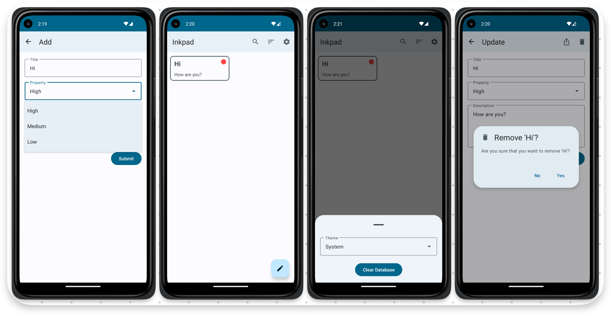
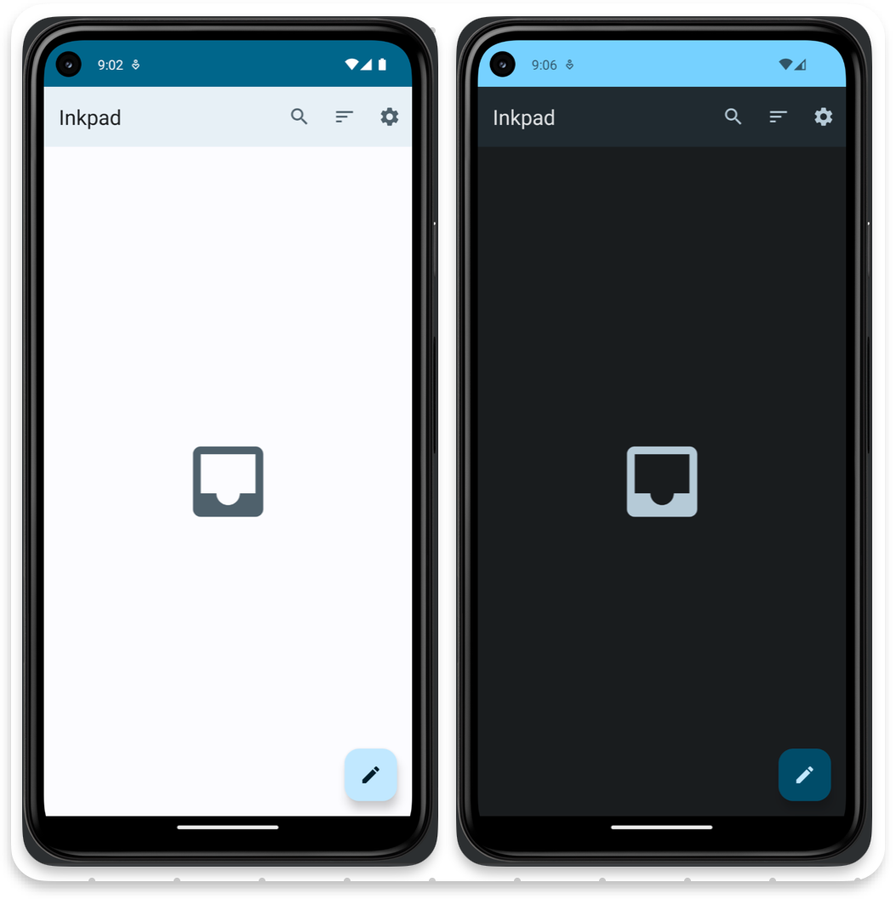

# Inkpad

## About

### Description

Inkpad is a pet-project that provides the ability to take notes

### Architecture

Clean Architecture with MVVM Pattern

### Technologies

- Kotlin (with Coroutines)
- Room
- Navigation
- Dagger
- LiveData
- DiffUtil

### Functionality

- Note:
  - Get all
  - Create
  - Update
  - Delete (either menu button or swipe to the left)
  - Delete all
  - Sort by high priority
  - Sort by low priority
  - Search
  - Share
- App:
  - Change the theme (future)
  - Change the language (future)

### Screenshots

